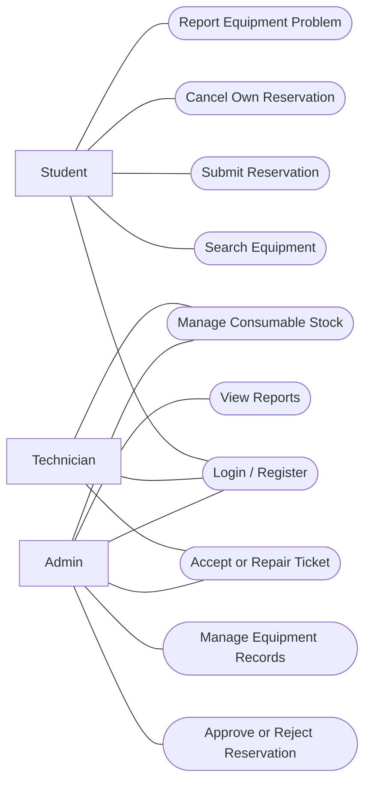
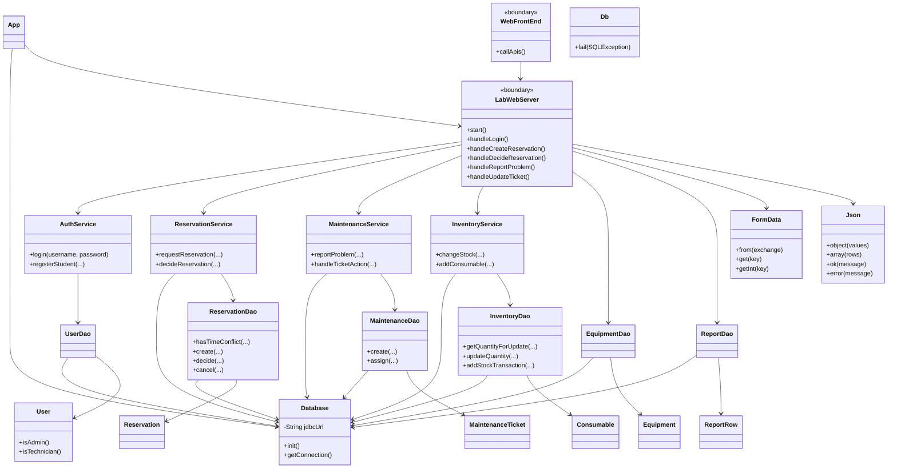
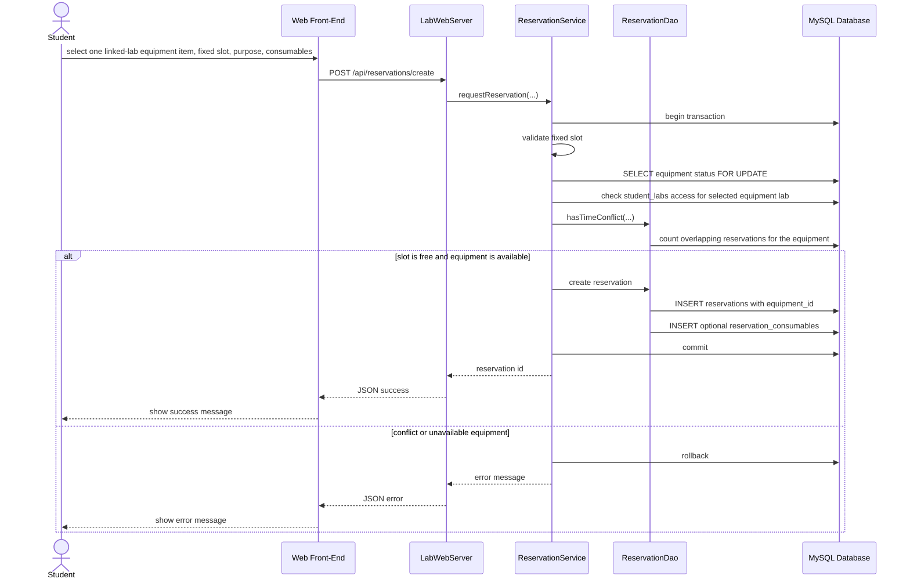
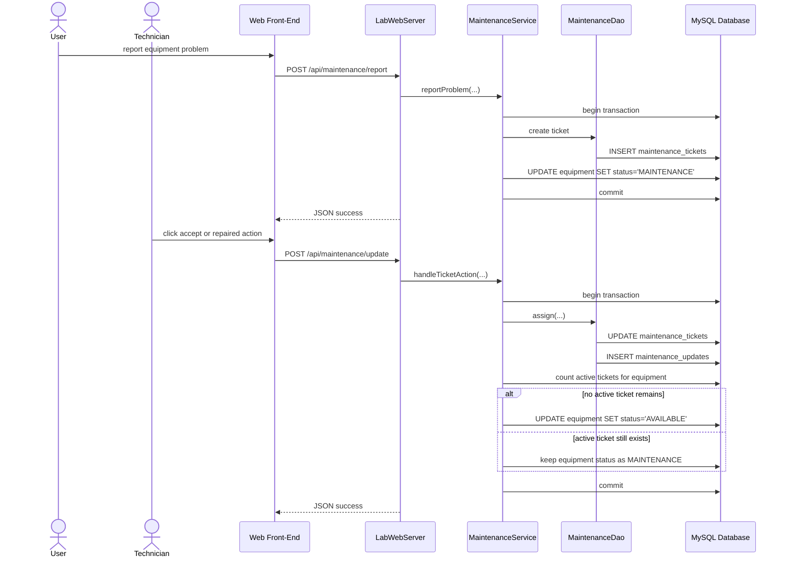
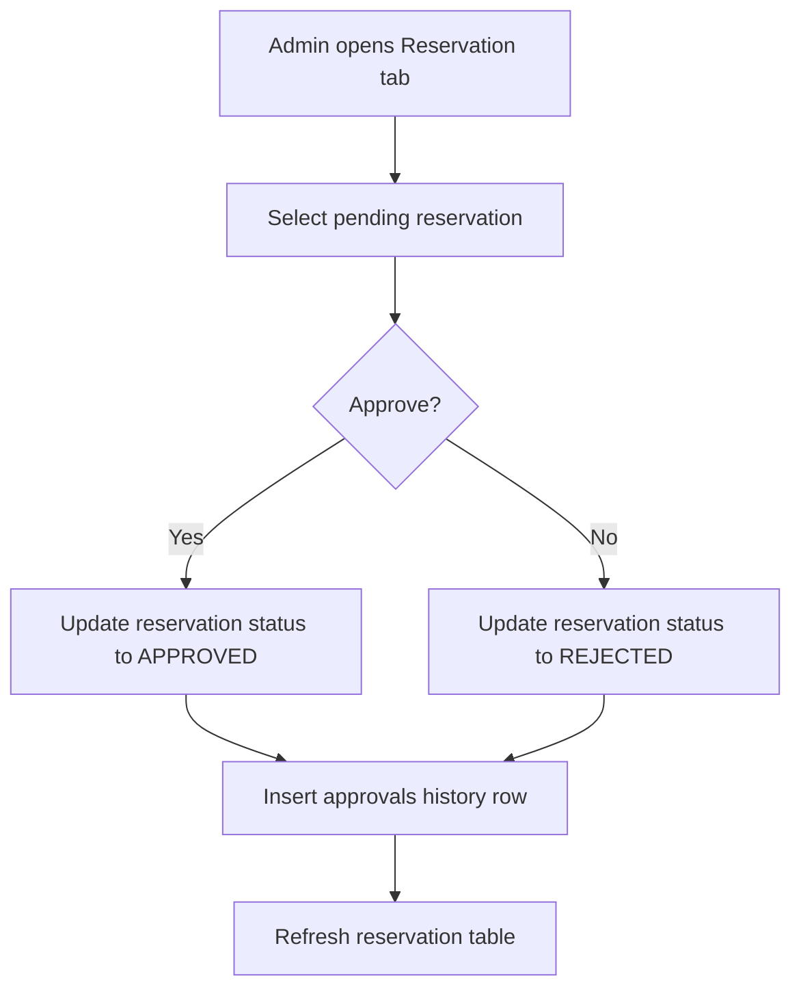

# UML Modeling Document

This document records the current UML material for the laboratory equipment management system. The recommended report figure is the formal UML class diagram below; the later Mermaid diagrams are kept as editable source material for the appendix or future modification.

## Recommended Report Figure

Use these files in the final report:

- `docs/uml-class-diagram-current.svg`
- `docs/uml-class-diagram-current.png`


This is the normal report-facing UML class diagram. It shows:

- class compartments with attributes and selected operations;
- entity classes such as `User`, `Lab`, `Equipment`, `Reservation`, and `Consumable`;
- association classes for many-to-many relationships, such as `StudentLab` and `ReservationConsumable`;
- multiplicities such as `1`, `0..1`, `0..*`, and `1..*`.

The figure is generated by:

```bash
node scripts/generate-uml-class-diagram.js
```

An additional mixed overview figure is available as `docs/uml-overview-current.svg` / `docs/uml-overview-current.png`. It is useful for presentation narration, but the class diagram above is the better choice for the UML section of the report.

## Model Notes

- `WebFrontEnd` is a boundary layer representing the HTML/CSS/JavaScript pages, not a Java class.
- `LabWebServer` is the web boundary class. It registers the API routes, parses form data, checks user permissions, and calls services/DAOs.
- Service classes contain the main business rules and transaction control.
- DAO classes contain SQL queries, joins, and insert/update operations.
- Model classes are simple Java objects used to carry application data.
- The database contains 11 physical tables and 3 SQL views in the current schema.

## Use Case Source



## Implementation Class Diagram Source

The following Mermaid diagram focuses on Java implementation classes. It is useful as editable supporting material, while the rendered figure above is the cleaner report-facing domain class diagram.



## Reservation Sequence Source



## Maintenance Sequence Source



## Reservation Approval Activity Source


