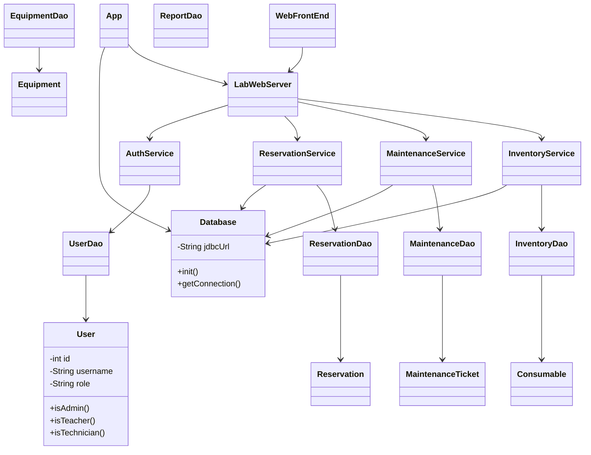
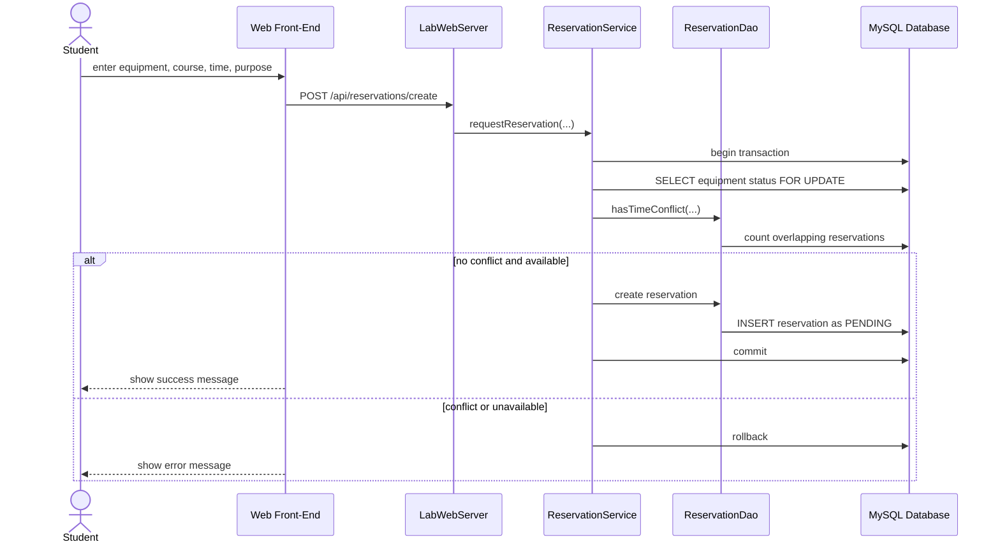
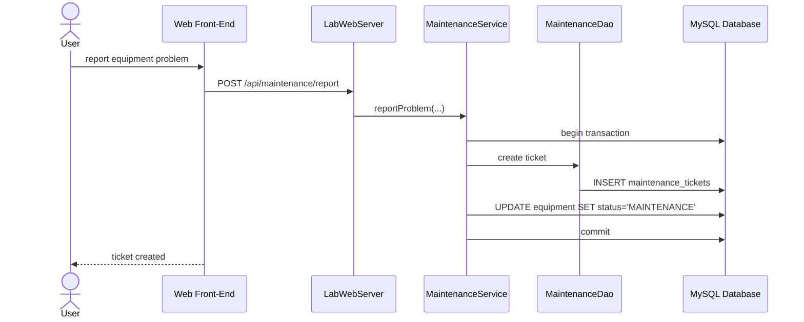
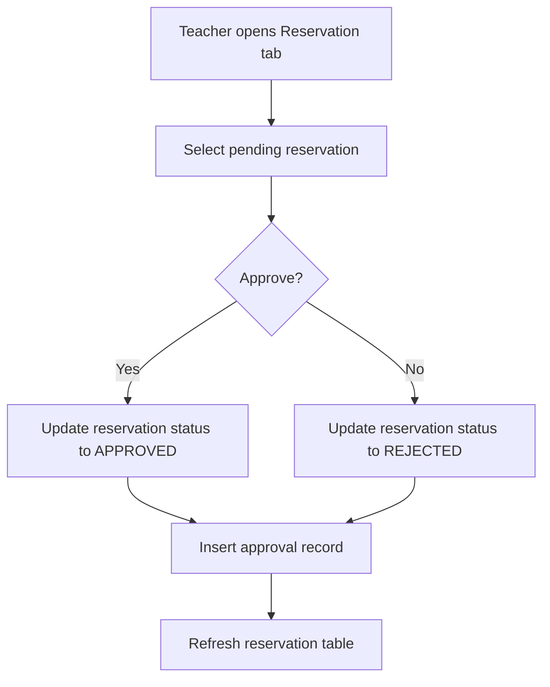

# UML Modeling Document

The diagrams are written in Mermaid text so they can be pasted into tools such as Mermaid Live Editor or Markdown previewers.

## Use Case Diagram

```mermaid
usecaseDiagram
actor Student
actor Teacher
actor Technician
actor Admin

Student --> (Login)
Student --> (Search Equipment)
Student --> (Submit Reservation Request)
Student --> (Cancel Own Reservation)
Student --> (Report Equipment Problem)

Teacher --> (Login)
Teacher --> (View All Reservations)
Teacher --> (Approve or Reject Reservation)
Teacher --> (View Reports)

Technician --> (Login)
Technician --> (Update Maintenance Ticket)
Technician --> (Manage Consumable Stock)

Admin --> (Login)
Admin --> (View All Reservations)
Admin --> (Approve or Reject Reservation)
Admin --> (Update Maintenance Ticket)
Admin --> (Manage Consumable Stock)
Admin --> (View Reports)
```

## Class Diagram



## Reservation Sequence Diagram



## Maintenance Sequence Diagram



## Activity Diagram: Reservation Approval


