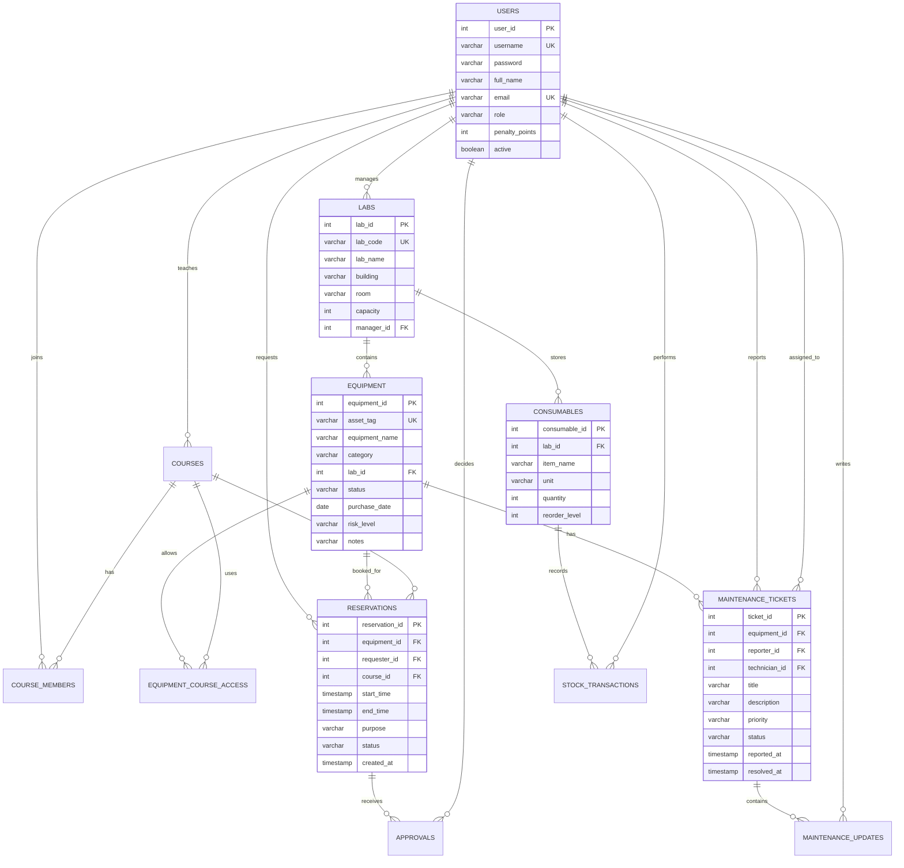

# Database Design Document

## Overview

The database stores users, laboratories, equipment, courses, reservations, approvals, maintenance tickets, maintenance updates, consumable stock, and stock transactions. It is designed to show common database course concepts: entity relationships, many-to-many relationships, primary keys, foreign keys, check constraints, indexes, views, joins, aggregation, and transactions.

## ER Diagram

## Table Summary

| Table | Purpose |
| --- | --- |
| `users` | Stores students, teachers, technicians, and administrators. |
| `labs` | Stores laboratory rooms and managers. |
| `equipment` | Stores physical equipment and current status. |
| `courses` | Stores course information. |
| `course_members` | Many-to-many relationship between users and courses. |
| `equipment_course_access` | Many-to-many relationship between equipment and courses. |
| `reservations` | Stores equipment reservation requests and approved bookings. |
| `approvals` | Stores teacher/admin decisions for reservations. |
| `maintenance_tickets` | Stores equipment fault reports and repair workflow. |
| `maintenance_updates` | Stores ticket update history. |
| `consumables` | Stores consumable stock in each lab. |
| `stock_transactions` | Stores stock in/out transaction history. |

## Relational Mapping Notes

- One lab contains many pieces of equipment, so `equipment.lab_id` is a foreign key.
- A user can join many courses and a course can contain many users, so `course_members` resolves the many-to-many relationship.
- Equipment can be available for multiple courses and each course can use multiple equipment items, so `equipment_course_access` resolves another many-to-many relationship.
- Each reservation is made by one user for one equipment item and optionally one course.
- A reservation can have approval records so the decision history is not lost.
- Maintenance tickets are linked to equipment and users. `technician_id` is nullable because a ticket can be open before assignment.
- Stock changes are not only stored as a current quantity. Each change is also inserted into `stock_transactions` for audit history.

## Constraints

Important constraints include:

- Unique usernames, emails, lab codes, asset tags, and course codes.
- Role check: `ADMIN`, `TEACHER`, `STUDENT`, or `TECHNICIAN`.
- Equipment status check: `AVAILABLE`, `RESERVED`, `IN_USE`, `MAINTENANCE`, or `RETIRED`.
- Reservation status check: `PENDING`, `APPROVED`, `REJECTED`, `CANCELLED`, `COMPLETED`, or `NO_SHOW`.
- Reservation time check: `end_time > start_time`.
- Stock quantity check: `quantity >= 0`.
- Foreign keys between all dependent tables.

## Indexes

- `idx_reservation_equipment_slot` supports conflict checking by equipment and time.
- `idx_reservation_status` supports filtering pending and approved requests.
- `idx_ticket_status` supports maintenance workflow filtering.
- `idx_equipment_status` supports equipment availability queries.

## Views

`v_equipment_status` joins equipment and lab data and includes open ticket count. It is used by the equipment UI.

`v_user_reservation_history` joins reservations, users, and equipment. It is useful for report writing and manual checking.

`v_lab_usage_report` aggregates reservation counts per lab. It is used by the reports page.

## Transaction Design

Reservation creation is transactional:

1. Lock the selected equipment row using `FOR UPDATE`.
2. Check that equipment status allows reservation.
3. Check overlapping reservations.
4. Insert the new pending reservation.
5. Commit if all checks pass, otherwise roll back.

Inventory change is transactional:

1. Lock the consumable row using `FOR UPDATE`.
2. Calculate the new quantity.
3. Reject the operation if the result is negative.
4. Update quantity.
5. Insert stock transaction history.
6. Commit.

Maintenance report is transactional:

1. Insert a maintenance ticket.
2. Update equipment status to `MAINTENANCE`.
3. Commit both changes together.

## CREATE TABLE Statements

The full SQL schema is stored in `src/main/resources/db/schema.sql`. The sample data is stored in `src/main/resources/db/seed.sql`.
